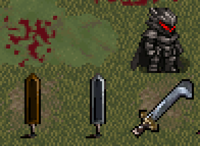

# Berserk for Cataclysm: Dark Days Ahead

Фанатский мод по мотивам манги Кэнтаро Миуры. Добавляет броню Берсерка, мечи Гатса и Зодда, профессии, испытания и противников: Зодда, Гриффита, Рыцаря-Черепа, Апостола Войда и демонов Тьмы.

## Поддерживаемая версия

Данные мода обновлены и проверены для стабильного релиза CDDA 0.I-1 «Ito-1». После обновления игры проверяйте [таблицу совместимости](docs/COMPATIBILITY.md) и запускайте валидатор.

## Установка

В репозитории находятся два независимых каталога модов:

- `mods/Berserk` — основной контент и графика для UltiCa (`UltimateCataclysm`);
- `mods/Berserk_chibi_tileset` — дополнительная графика для ChibiUltica, MSXotto+ и перечисленных в ней совместимых наборов.

Скопируйте нужные каталоги из `mods/` в каталог `mods` установленной игры. Не копируйте весь репозиторий как один мод.

Для UltiCa включите только **Berserk**. Для ChibiUltica или MSXotto+ включите **Berserk** и **Berserk: Extended tileset** в одном мире.

При обновлении сначала удалите старые каталоги `Berserk` и `Berserk_chibi_tileset`, затем скопируйте новые. Это предотвращает загрузку файлов, оставшихся от прежней структуры `optional/chibi_tileset`.

## Проверка

Из корня репозитория:

```bash
python tools/validate_mod_assets.py
python tools/package_release.py
```

Готовые архивы создаются в `dist/`. Проверять в игре следует именно содержимое этих архивов.

## Разработка графики

Общий список совместимых тайлсетов хранится в `tools/tileset/tileset_compatibility.txt`. После его изменения выполните:

```bash
python tools/tileset/apply_tileset_compatibility.py
```

Исходные изображения Ber_Suit не входят в репозиторий. Если они доступны отдельно, листы можно пересобрать командой:

```bash
python tools/tileset/build_ber_suit_eq_sheets.py --source /path/to/Ber_Suit
```



## Правовой статус

Это некоммерческий фанатский проект. Он не связан с правообладателями Berserk и не одобрен ими.
