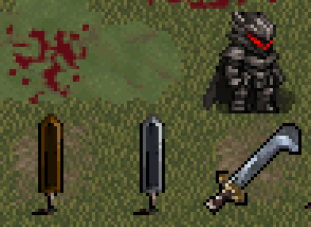

# Berserk 1.5 for Cataclysm: Dark Days Ahead

Фанатский мод по мотивам манги Кэнтаро Миуры. Добавляет броню Берсерка, мечи Гатса и Зодда, профессии, испытания и противников: Зодда, Гриффита, Рыцаря-Черепа, Апостола Войда и демонов Тьмы.

Описание обновления: [Release 1.5 (English / Русский / 中文)](docs/RELEASE_1.5.md).
Команды сборки и публикации: [PowerShell](docs/RELEASING_1.5.md).

## Поддерживаемая версия

Данные мода обновлены и проверены для стабильного релиза CDDA 0.I-1 «Ito-1». После обновления игры проверяйте [таблицу совместимости](docs/COMPATIBILITY.md) и запускайте валидатор.

## Установка

В репозитории находятся два независимых каталога модов:

- `mods/Berserk` — основной контент и графика для UltiCa (`UltimateCataclysm`);
- `mods/Berserk_chibi_tileset` — дополнительная графика для ChibiUltica, MSXotto+ и перечисленных в ней совместимых наборов.

Copy the chosen folders from this repository's `mods/` into the game's **user**
`mods/` directory. In a portable Windows build, this is `mods/` beside
`cataclysm-tiles.exe`. Extract the ZIP **inside that directory**: the final path
must be `<CDDA>/mods/Berserk/modinfo.json`, with the catalogs under
`<CDDA>/mods/Berserk/lang/mo/ru/LC_MESSAGES/Berserk.mo` and
`<CDDA>/mods/Berserk/lang/mo/zh_CN/LC_MESSAGES/Berserk.mo`.

Скопируйте нужные каталоги из `mods/` репозитория в **пользовательский** каталог
`mods/` игры. В портативной сборке Windows он находится рядом с
`cataclysm-tiles.exe`. Архив распаковывайте **в эту папку**: должны получиться
`<CDDA>/mods/Berserk/modinfo.json` и указанные выше файлы перевода.

CDDA 0.I-1 сначала регистрирует моды из `data/mods/`, а затем из
пользовательского `mods/`. Если один и тот же мод есть в обоих местах, игра
оставляет старую копию из `data/mods/` и игнорирует новую. Переводы сторонних
модов она при этом ищет только в пользовательском `mods/`. Для обновления
обязательно уберите `data/mods/Berserk/` и `data/mods/Berserk_chibi_tileset/`,
затем полностью перезапустите игру. Папки `save/` и `config/` не затрагивайте.
Не копируйте весь репозиторий как один мод.

Если перевод всё ещё не виден, откройте `debug.log`: строки загрузки файлов
Berserk должны указывать на `mods\\Berserk\\`, а не на `data/mods\\Berserk\\`.

When updating from earlier 1.5 test archives, close the game and remove
`<CDDA>/cache/mods/Berserk/` and, if present,
`<CDDA>/cache/mods/Berserk_chibi_tileset/`. These are generated caches, not
the installed mods or saves. Earlier archives assigned every file the same
timestamp, allowing CDDA 0.I-1 to reuse obsolete JSON even after replacing
the mod folder. New archives preserve source file modification times.

При обновлении с прежних тестовых архивов 1.5 закройте игру и удалите
`<CDDA>/cache/mods/Berserk/` и, если есть,
`<CDDA>/cache/mods/Berserk_chibi_tileset/`. Это кэш, который игра создаст заново.
Прежний упаковщик ставил всем файлам одну дату: CDDA 0.I-1 могла читать старый
JSON из кэша даже после полной замены папки мода. Это вызывало повторную ошибку
`Unread data ... tiles-new` у руки-пушки. Новые архивы сохраняют даты изменения
исходных файлов. Предупреждение `Stale game data detected` также означает
несовпадение с кэшем; указанная очистка его устраняет. `save/` и `config/` не удаляйте.

从旧的 1.5 测试压缩包更新时，请先关闭游戏，然后删除
`<CDDA>/cache/mods/Berserk/` 和（如果存在）
`<CDDA>/cache/mods/Berserk_chibi_tileset/`。这些是游戏自动生成的缓存，
不是模组或存档。旧压缩包给所有文件设置了相同的修改时间，导致 CDDA 0.I-1
即使在替换模组文件夹后仍可能读取旧 JSON。新压缩包保留源文件的修改时间。
请勿删除 `save/` 或 `config/`。

Для UltiCa включите только **Berserk**. Для ChibiUltica или MSXotto+ включите **Berserk** и **Berserk: Extended tileset** в одном мире.

При обновлении сначала удалите старые каталоги `Berserk` и `Berserk_chibi_tileset` из обоих каталогов модов, затем скопируйте новые только в пользовательский `mods/`. Это предотвращает загрузку второй копии мода и файлов, оставшихся от прежней структуры `optional/chibi_tileset`. Для UltiCa не включайте дополнительный мод `Berserk_chibi_tileset`.

## Проверка

Из корня репозитория:

```bash
python tools/validate_mod_assets.py
python tools/package_release.py
```

Готовые архивы создаются в `dist/`. Проверять в игре следует именно содержимое этих архивов.

## Разработка графики

Общий список совместимых тайлсетов хранится в `tools/tileset/tileset_compatibility.txt`. После его изменения выполните:

```bash
python tools/tileset/apply_tileset_compatibility.py
```

Исходные изображения Ber_Suit не входят в репозиторий. Если они доступны отдельно, листы можно пересобрать командой:

```bash
python tools/tileset/build_ber_suit_eq_sheets.py --source /path/to/Ber_Suit
```



## Правовой статус

Это некоммерческий фанатский проект. Он не связан с правообладателями Berserk и не одобрен ими.
