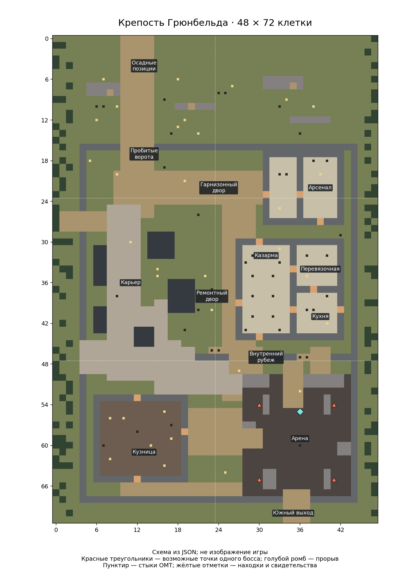

# Крепость Грюнбельда и завершение главы — 3.0 New Horizon

> Описание предыдущей итерации. Актуальная планировка и совместимость старых карт: [блок E](P5_FLORA_AND_STRONGHOLD_LAYOUTS.md).

Рабочая ветка: `codex/3.0-new-horizon`. Рубеж до этой итерации: `5b01f76`, ветка `codex/3.0-before-grunbeld-fortress`. Игра и её бинарник не запускались. Главная ветка не объединялась.

## Крепость

Размер сохранён: 2 × 3 OMT, 48 × 72 местных клетки. Это занятый апостолом опорный пункт адаптации мода, не канонический Долдрей.

| Зона | Содержание и выбор |
| --- | --- |
| Подход | Разбитые осадные заслоны, брошенная телега, приказы; разведка двух маршрутов |
| Северный двор | Пробитые ворота, список эвакуации, арсенал и служебный запас провианта |
| Карьер | Огибающий каменные уступы путь, верёвка, долото, отметки беглецов; проход к ремонтному двору |
| Казармы | Четыре постели, письмо солдата, перевязочная, кухня, кладовая и ремонтная комната |
| Внутренний рубеж | Несколько разнесённых проломов и предупреждение о последнем столкновении |
| Кузница | Рабочий стол, остывший очаг, пень наковальни, клещи, металл, ткань и записки о жаре |
| Арена | Обгоревший двор, отдельные каменные укрытия; северный и западный подходы, южный выход |

56 клеток мебели/свидетельств, 10 конечных наборов находок, 6 обычных демонов поддержки. Пол под мебелью сохранён; внутренние комнаты, открытый двор и карьер имеют разные определения местности. Карьер немного медленнее обычного пола. Перевязка — ткань и вода; современного оружия, батареек и лекарств в крепости нет. Одежда у кузницы не объявлена огнеупорной. Очаг и пень — следы прежней мастерской, не новая автономная кузнечная система.

Тайник сначала превращается в осмотренную мебель; только подтверждённое превращение выдаёт вещи на его клетку. Состояние хранится самой картой, а не одним общим флагом для всех находок. Обгоревшая застёжка знамени — личное свидетельство, без бонуса и без замены уникальной реликвии.

## Бой и старые карты

Сохранены ID шести OMT, точка печати `(12,7)` в финальном OMT, зона начала встречи `(8..15,8..15)` и четыре прежние скрытые точки появления. До входа на арену босс не размещается в mapgen. После удачного появления продолжает действовать прежняя система одной встречи, принятия уже живого босса и двух фаз.

Характеристики, подготовленные атаки и переход рыцарь → дракон не менялись. Дракон остаётся продолжением одного противника. После гибели оригинала у Флоры крепость содержит оставшуюся рану; второй оригинал и второй Осколок не создаются. Небольшое свидетельство гарнизона можно найти при любом исходе.

Сгенерированные карты не перестраиваются. Старые координаты печати, боя и сохранённые состояния продолжают работать. Новую планировку проверять в ещё не созданной крепости, не ожидать, что установка обновления изменит уже исследованную карту.

## Пожар и дальнейший путь

После успешного побега из дома Флоры появляется небольшой итог: потерян дом и его защита, тьма продолжает расти в мире Катаклизма, закрытие всех разломов потребует титанической работы. Убитые апостолы остаются мёртвыми, уцелевшие враги не исчезают.

Следующая сводка зависит от фактического состояния каждой охоты:

| Состояние | Действие |
| --- | --- |
| Не найдено | Выбрать путь в журнале охот |
| Логово найдено | Исследовать и войти на внутреннюю арену |
| Бой начат | Победить или отступить для подготовки |
| Хранитель побеждён | Осмотреть и закрыть местный прорыв |
| Прорыв закрыт | Забрать оставшуюся реликвию |
| Награда уже выдана | Охота завершена |

Отдельная ветка объясняет гибель Грюнбельда у Флоры. Нет безусловного поручения идти к Графу. Журнал не создаёт места и не переносит ранее найденные цели.

Новый **журнал пути после Затмения** выдаётся после спасения, а в старом сохранении — через Рыцаря или существующий журнал охот. Его можно читать из инвентаря. Сводка включает пристанище, необязательную запись рассвета, Флору и четыре независимые охоты. Семь существующих миссий и их указатели сохранены. Новые обязательные миссии для ночи/пристанища не добавлены: используются уже существующие критерии их журнала, без проверки несуществующих флагов воды/постели.

Первый цикл получает одноразовый итог после пожара, закрытия Пепельного и четырёх именованных прорывов. Не забранные награды остаются видны и доступны; их сбор не обязателен для итога. Дальний мир и Клеймо не объявляются очищенными.

## Мировые встречи, Клеймо, тени

* **Мировое заселение:** новая отметка v5 принадлежит целевому OMT. Четыре подхода больше не добавляют четыре независимых слоя врагов. Для сохранений с v4 проверяются старые отметки соседних источников; обработанный ранее участок консервативно пропускается. Коэффициенты mapgen не повышены, уже существующие враги не удаляются.
* **Общий контроль близкой плотности:** мировые попытки теперь используют тот же счётчик загруженных демонов, что Клеймо и броня; при восьми близких демонах мировая попытка пропускается. Список дополнен существующими хранителями мест, первой охотой, хранителем прорыва и активным финальным проявлением. Это НЕ строгий предел общего числа существ: native mapgen может хранить группы и материализовать их позже. Отдельную жёсткую квоту отложенных групп надо исследовать после игрового теста; текущую правку нельзя рекламировать как гарантированное «ровно 20% зомби».
* **Клеймо:** прежняя часовая ночная попытка на расстоянии 20–30 местных клеток и прежние правила защищённого пристанища сохранены. Ночь определяется прежним игровым условием, не новой фиксированной таблицей часов.
* **Тени брони:** прежние собственные волны и шанс иллюзорных теней сохраняются. После Затмения учитывается общий счётчик; закрытие местного прорыва не отменяет проклятие брони.
* **Тихий район:** радиус около 48 местных клеток от сохранённой точки каждого закрытого прорыва. Ограничиваются новые мировые проявления у этой точки; существующие враги и далёкие прорывы остаются. В журнале это объяснено.

## Реликвии и атаки

Бонусы сохранены: Печать +20% по списку демонов, Узел 150 → 210 секунд, Покров +1 к уклонению, Осколок −20% входящего теплового урона и прежнее охлаждение. Печать дополнительно признаёт хранителей часовни и экспедиции — они отсутствовали в прежнем списке. Дружелюбные Флора, Рыцарь и свидетели не добавлены.

Реликвии имеют совместимые предметные определения для ношения; фактические совместные бонусы в бою не проверены игрой. Подготовка, фиксированная область/линия, отмена и восстановление атак сохранены. Ритм атак без игрового теста не ускорялся. Регенерация и неуязвимость не добавлялись.

## Статическая проверка и следующий игровой проход

Выполнены: JSON/ссылки/известные обязательные поля 0.I-1; оба маршрута, доступность осмотров, отступления и свободные точки появления; геометрическая проверка скрытых кандидатов (не замена native видимости); сравнение фаз, старых ID, координат и миссий с рубежом; разбор 24 вариантов состояний охот; компиляция RU/CN. Новые формы `set_string_var` с `i18n`, динамические `run_eocs` и координатные переменные сверены с исходником тега 0.I-1.

Дома проверить:

1. Новая крепость: главный путь и карьер, все десять находок, возврат после сохранения без повторной выдачи.
2. Вход на арену: один Грюнбельд, переход в дракона, выход с любой стороны и возвращение к тому же противнику.
3. Смерть оригинала у Флоры: в крепости нет второго живого оригинала; прорыв закрывается, свидетельство остаётся, вторая реликвия не выдаётся.
4. Пожар при разных завершённых охотах: следующий шаг соответствует оставшимся задачам; старая карта и руины не меняют чужие состояния.
5. Открытие журнала на RU/CN: все переведённые строки состояния видны в одном окне, миссии сохранили прежние цели.
6. Подход к одному городскому OMT с четырёх сторон и загрузка сохранения: нет четырёх повторных заселений; фактическую плотность и работу загруженного счётчика оценить в игре.
7. Совместное ношение четырёх реликвий; подготовленные сильные атаки — видимость угрозы и настоящий промах после ухода.
